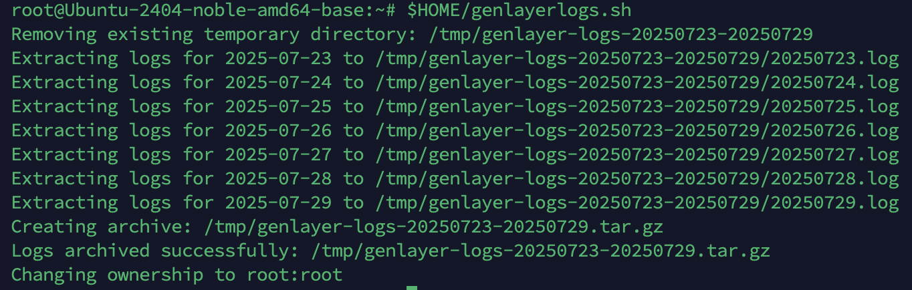

## Create a Bash file named genlayerlogs.sh
```
cat > "$HOME/genlayerlogs.sh" <<'EOF'
#!/bin/bash

# Configuration
SERVICE_NAME="genlayer-node.service"
BASE_DIR="/tmp"
OWNER_AND_GROUP="root:root"

# Calculate date range (excluding today)
END_DAY_ISO=$(date -d "yesterday" +%Y-%m-%d)
START_DAY_ISO=$(date -d "$END_DAY_ISO - 6 days" +%Y-%m-%d)
END_DAY=$(date -d "yesterday" +%Y%m%d)
START_DAY=$(date -d "$END_DAY_ISO - 6 days" +%Y%m%d)

# Temporary directory for logs
TEMP_DIR="$BASE_DIR/genlayer-logs-$START_DAY-$END_DAY"

# Check if the temporary directory exists, and remove it if it does
if [ -d "$TEMP_DIR" ]; then
  echo "Removing existing temporary directory: $TEMP_DIR"
  rm -rf "$TEMP_DIR" || { echo "Failed to remove $TEMP_DIR"; exit 1; }
fi

# Create the temporary directory
mkdir -p "$TEMP_DIR" || { echo "Failed to create $TEMP_DIR"; exit 1; }

# Extract the logs for each day (excluding today)
for ((i=0; i<=6; i++)); do
    LOG_DATE_ISO=$(date -d "$START_DAY_ISO + $i days" +%Y-%m-%d)
    LOG_DATE_FMT=$(date -d "$START_DAY_ISO + $i days" +%Y%m%d)
    LOG_FILE="$TEMP_DIR/$LOG_DATE_FMT.log"

    echo "Extracting logs for $LOG_DATE_ISO to $LOG_FILE"
    journalctl -u "$SERVICE_NAME" --since "$LOG_DATE_ISO 00:00:00" --until "$LOG_DATE_ISO 23:59:59" > "$LOG_FILE"
    
    if [ $? -ne 0 ]; then
        echo "Failed to extract logs for $LOG_DATE_ISO"
        exit 1
    fi
done

# Create a compressed tar file
TAR_FILE="$BASE_DIR/genlayer-logs-$START_DAY-$END_DAY.tar.gz"
echo "Creating archive: $TAR_FILE"
tar -czf "$TAR_FILE" -C "$BASE_DIR" "genlayer-logs-$START_DAY-$END_DAY"

# Cleanup
if [ $? -eq 0 ]; then
    echo "Logs archived successfully: $TAR_FILE"
    echo "Changing ownership to $OWNER_AND_GROUP"
    sudo chown -R "$OWNER_AND_GROUP" "$TEMP_DIR"
    sudo chown "$OWNER_AND_GROUP" "$TAR_FILE"
else
    echo "Failed to create tar file"
    exit 1
fi
EOF

# Make the script executable
chmod +x "$HOME/genlayerlogs.sh"

echo "Script has been created at: $HOME/genlayerlogs.sh"
echo "Run it with: bash $HOME/genlayerlogs.sh"
```
## Create Cron Job
Automatically execute the `genlayerlog.sh` file once a week at 1:00 AM on Friday.
Open the current user's cron editor:
```
sudo crontab -e
```
Add the following line to the file to schedule the task:
```
0 1 * * 5 $HOME/genlayerlogs.sh
```
## Test script
```
$HOME/genlayerlogs.sh
```


### The log file is located at /tmp/genlayer-logs*.tar.gz